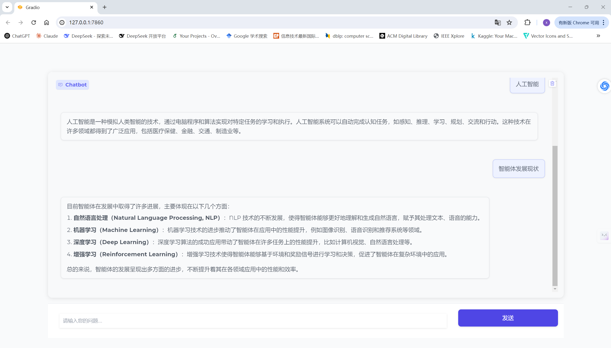

# LLM & 智能体 理论基础和项目实战

>**author@ zhaxinji**



### 核心教程链接
* [面向开发者的大模型手册](https://datawhalechina.github.io/llm-cookbook/#/)
* [大语言模型的前世今生](https://bbs.huaweicloud.com/blogs/416109)
* [ChatGPT的工作原理，这篇文章说清楚了！](https://mp.weixin.qq.com/s/BcuMoaLYLPVMB--GW7O5ow)
* [基于大语言模型的AI Agents](https://www.breezedeus.com/article/ai-agent-part1)
* [AGI 通用知识模型和认知架构：打造一个能够思考、学习和创造的人工智能的关键所在](https://mp.weixin.qq.com/s/9opOMPzugyPCklVS9k21XQ)
* [最强视频大模型 SORA 技术详解](https://mp.weixin.qq.com/s/JX4mhn8dB1l5jmqQ4e5U6A)
* [DeepSeek-R1技术大揭秘：论文核心原理拆解与模型性能突破关键](https://mp.weixin.qq.com/s/7ObWkfTY-4Sw6MTQ-9lP8g)
* [谷歌 AI Agent 白皮书宣告 2025 年迈入 Agent 时代](https://mp.weixin.qq.com/s/NLOrem1dtm1kiRAwziMbPw)
* [开源MetaChain：LLM智能体全自动无代码框架！让普通人也能玩转智能体！](https://mp.weixin.qq.com/s/aTkh5vulbFMaf0Mf4H0KuA)
* [清华周杰&鲁继文团队 | 开源自动驾驶大模型！](https://mp.weixin.qq.com/s/vBGeJ-y_e43ZReITDPZ-9g)

### Agent代表性开源应用
* [Langchain-Chatchat](https://github.com/chatchat-space/Langchain-Chatchat) - 基于 Langchain 与 ChatGLM 等语言模型的本地知识库问答
* [Dify](https://github.com/langgenius/dify) - 简单的创造和运营基于 GPT-4 的 AI 原生应用
* [Coze](https://www.coze.com/home) - 下一代 AI 智能体开发平台
* [AutoGen](https://github.com/microsoft/autogen) - Enable Next-Gen Large Language Model Applications.
[微软Agent框架AutoGen论文及原理解读](https://mp.weixin.qq.com/s/HgdAn2Bp10T7jCf5nZhdkw)
  
## Agent项目实战
### 所选核心技术
* Langchain
* Gradio
* Docker
* Redis
* Elasticsearch

>**注意：数据部分可以根据自己本地论文合集来构建外部知识库，此处没有上传我选择的论文**

### 核心代码说明
#### UI交互部分
该部分是项目核心部分，负责相应事件及时响应，并获取相应数据来及时渲染网页，整个思路采用
目前对话大模型主流方式，即检索增强生成。后面再具体介绍每个部分作用

```python
def chat(user_input, info_display, history):
    info_display.append((user_input, None))
    history.append((user_input, None))
    tmp_btn = gr.Button("赞同", elem_id="like_button", visible=False)
    yield format_message(info_display), format_message(info_display), format_message(history), "", tmp_btn  # 清空输入框，立即更新界面

    prompt = user_input
    faq_res = faq_recall(str(user_input))

    if faq_res:  
        info_display[-1] = (user_input, faq_res)  
        history[-1] = (prompt, faq_res) 
        tmp_btn = gr.Button("赞同", elem_id="like_button", visible=False)
        yield format_message(info_display), format_message(info_display), format_message(history), "", tmp_btn  # 清空输入框

    else:
        class_ = semantics_classify(user_input)
        if class_ == "专业咨询":  
            rerank_results = search_api(user_input, SEARCH_RESULTS_NUM)
            prompt = build_llm_prompt(user_input, rerank_results)

        history[-1] = (prompt, None)  
        response_content = ""
        for partial_response in deepseek_chat(history):
            response_content = partial_response  
            info_display[-1] = (user_input, response_content)  
            tmp_btn = gr.Button("赞同", elem_id="like_button", visible=False)
            yield format_message(info_display), format_message(info_display), format_message(history), "", tmp_btn  

        info_display[-1] = (user_input, response_content)  
        history[-1] = (prompt, response_content)  
        tmp_btn = gr.Button("赞同", elem_id="like_button", visible=True)
        yield format_message(info_display), format_message(info_display), format_message(history), "", tmp_btn  

        #  ......
        
    btn.click(chat,
              inputs=[txt, info_display, history],
              outputs=[chatbot, info_display, history, txt, like_btn],
              queue=True)

    txt.submit(chat,
               inputs=[txt, info_display, history],
               outputs=[chatbot, info_display, history, txt, like_btn],
               queue=True)

    like_btn.click(cache_agent_answer,
                   inputs=[info_display],
                   outputs=[like_btn],
                   queue=True)

```

#### 数据处理
这部分主要是对论文（英文的PDF）进行处理，会使用一些PDF工具和大模型来从
PDF文本中抽取出最重要的字段，比如标题、作者、摘要、正文、参考文献等，
需要设计相应的prompt来进行抽取

```python
def extract_date_and_title(file_name):
    
    # ......
    
    return date, title

def get_authors(text: str):
    
    # ......
    
    return data_dict

def get_abstract(text: str):
    
    # ......
    
    return result

def find_and_concatenate(lst, keyword='REFERENCES\n'):
    
    # ......
    
    return ""

def load_partial_json(result):
    
    # ......
    
    return data_dict

def get_references(text: str):
    
    # ......
    
    return data_dict

def get_appendix(text: str):
    
    # ......
    
    return result


    
    # ......
    # ......

```
抽取了PDF中的核心字段后，我们需要将抽取的信息存储起来，
我们选择ElasticSearch做为存储引擎，ElasticSearch除了支持传统的全文索引外，
还支持基于向量的相似查询。关于ElasticSearch的安装和使用请自行查看

```python
def create_index():
    
    # ......
    
    return ''

def insert_into_es(documents: list):
    
    # ......
    
    return ''

def load_paper_2_es(paper_info: dict):
    
    # ......
    
    return ''

def load_all_papers_2_es(path: str):
    
    # ......
    
    return ""


```

#### 召回阶段
召回阶段会基于用户的输入从ElasticSearch或Redis中对相关的知识进行召回，
召回后的内容会基于排序算法跟用户的输入进行匹配，筛选出最匹配用户意图的内容。
用户的问题与之前已经回答过的问题非常类似时，会直接从Redis中召回相关问题的答案，
否则会利用全文索引、向量相似召回跟用户问题相关的内容，
召回的目的是从多个维度将用户的问题相关的可能答案事先找到，
方便后续流程进一步精准定位问题的答案。

全文索引阶段基于用户输入的关键词从ES索引中匹配相关的论文，
我们主要匹配title、abstract、body这3个核心字段，最返回的是最匹配的论文。
```python
def full_search(search_text: str) -> List[Dict]:
    
    # ......
    
    return response

```

向量召回阶段基于用户输入的文本，将文本转为嵌入向量，
然后从ElasticSearch中利用KNN搜索查找最相似的文章，
我们在数据预处理阶段，已经对文章的摘要进行了向量化处理并存入ElasticSearch中了，
具体对应字段semantic_vector
```python
def vector_search(search_text: str = "llm agent") -> List[Dict]:
    
    # ......
    
    return response

def knn_search(search_text="llm agent"):
    
    # ......
    
    return response


```

FAQ召回是基于用户已经回答过的问题进行召回，
这些问题及对应的答案已经事先存储到了Redis中
```python
def find_max_and_index(values):
    
    # ......
    
    return max_value, index

def find_most_similar(text: str, text_list: list):
    
    # ......
    
    return index, text_list[index], max_value

def faq_recall(search_text: str) -> str:
    
    # ......
    
    return response_content

```

#### 知识排序
知识排序是针对已经召回的内容，利用排序算法（bge-reranker-v2-m3）进一步判断用户的输入跟内容的相似度，
找到跟用户的问题（意图）最匹配的内容，最匹配的内容最有可能是问题的答案。
通过排序（从召回的几十条内容中选择最匹配的几条），大大缩小了大模型的搜索空间，
可以让大模型在有限的上下文长度限制下更精准地找到最匹配的答案。
```python
def rerank_search_results(search_text: str, full_search_recall: List[Dict], 
                          vec_recall: List[Dict], keep_num: int = 10) -> List[Dict]:
    
    # ......
    
    return result_list

```

#### 搜索pipeline实现
搜索pipeline就是将召回、排序这2个阶段串联起来（封装上面的全文搜索召回、向量召回、知识排序这3个子模块），
方便后面的智能体可以一步到位从ElasticSearch中找到最匹配的内容。
```python
def search_api(search_text: str = Query(..., description="搜索词"),
               keep_num: int = Query(1000, description="返回结果数量")):
    
    # ......
    
    return rerank_results

```
其余部分，比如Redis相关配置，交互流式处理等其自行查看.......